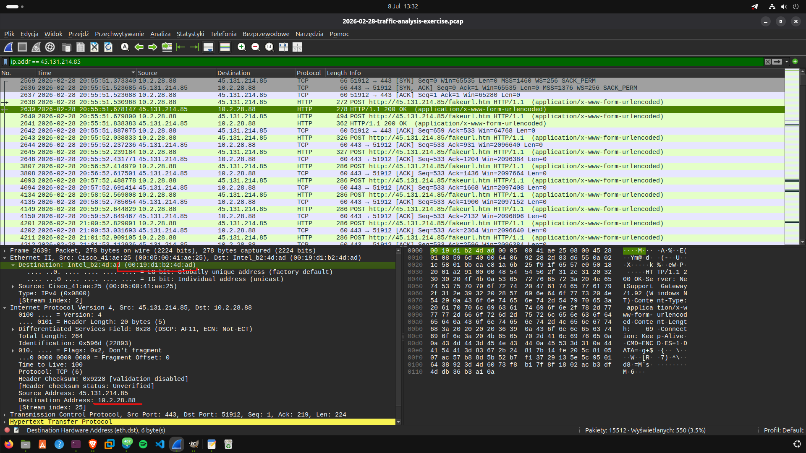
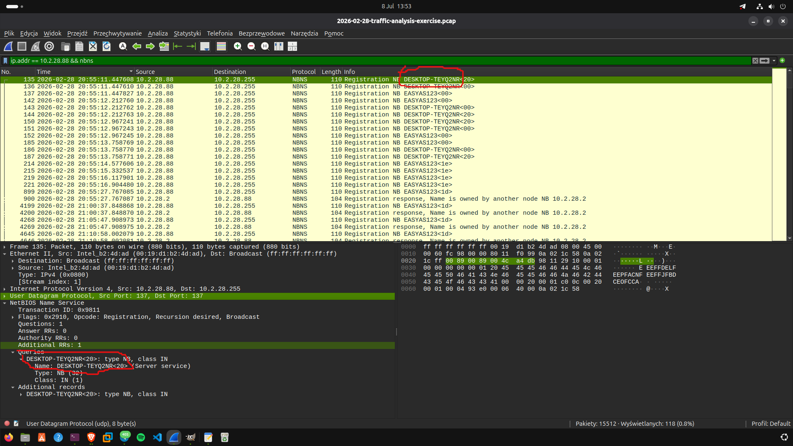
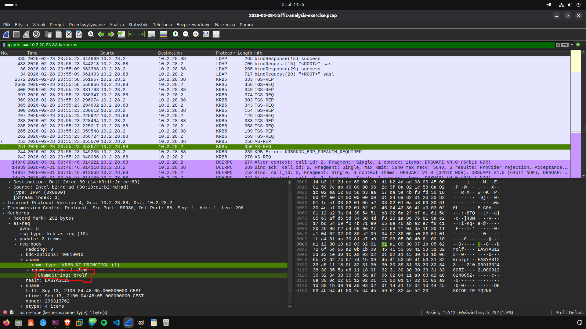
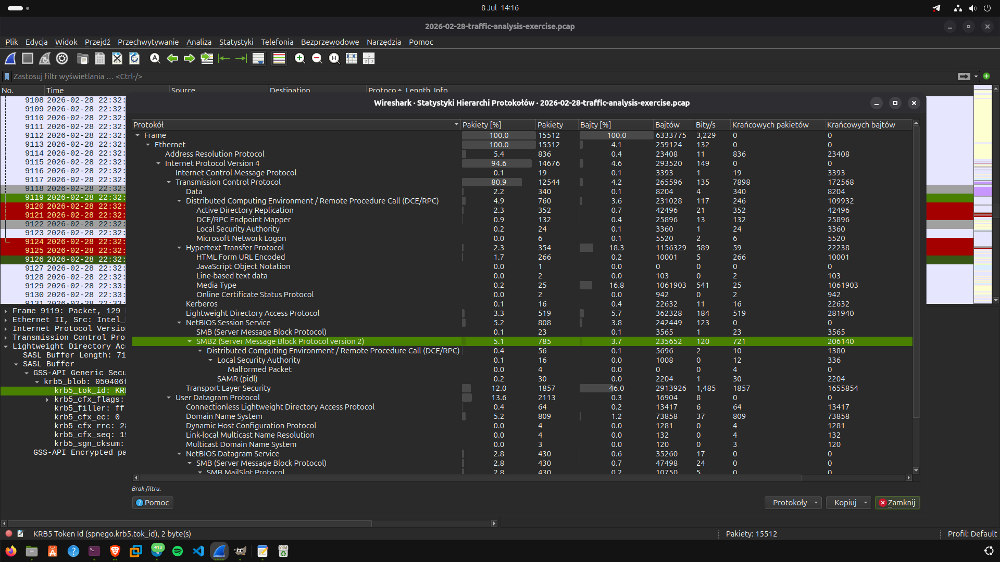
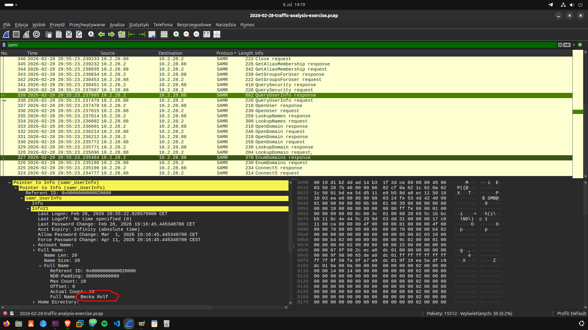

---
 
layout: post 
title: "C2 Traffic & User Enumeration via SAMR"
date: 2026-02-28 
categories: [network-analysis]

---


# Traffic Analysis Exercise – analiza ruchu sieciowego (pcap)

Analiza pliku `2026-02-28-traffic-analysis-exercise.pcap` w Wiresharku. Celem było zidentyfikowanie zainfekowanego hosta, jego nazwy, użytkownika oraz danych o nim na podstawie ruchu sieciowego generowanego przez atakującego.

## Środowisko i narzędzia

- **Narzędzie:** Wireshark
- **Plik:** `2026-02-28-traffic-analysis-exercise.pcap`
- **IP atakującego:** `45.131.214.85`

## Krok 1 – Identyfikacja zainfekowanego hosta

Punktem wyjścia był filtr na ruch pochodzący od atakującego:

```
ip.addr == 45.131.214.85
```

Po przefiltrowaniu ruchu udało się namierzyć zainfekowanego hosta:

- **IP:** `10.2.28.88`
- **MAC:** `00:19:d1:b2:4d:ad`

Widoczna jest komunikacja HTTP POST do `fakeurl.htm` z danymi zakodowanymi w polu `application/x-www-form-urlencoded` (w hexdumpie widać m.in. ciąg `CMD:ENC...DATA=...`), co wskazuje na ruch typu C2 (command and control).



## Krok 2 – Poszukiwanie nazwy hosta

Pierwsza próba – filtrowanie protokołu DHCP:

```
ip.addr == 10.2.28.88 && dhcp
```

Pakiety DHCP dla tego hosta były obecne w ruchu, jednak żaden z nich nie zawierał nazwy hosta.

Druga próba – protokół **NBNS** (NetBIOS Name Service), odpowiadający za tłumaczenie nazw komputerów na adresy IP w sieci lokalnej:

```
ip.addr == 10.2.28.88 && nbns
```

Znaleziona nazwa hosta: **`DESKTOP-TEYQ2NR`**



## Krok 3 – Identyfikacja nazwy użytkownika

Nazwę użytkownika znaleziono w protokole **Kerberos**, który służy do uwierzytelniania w sieciach Windows/Active Directory:

```
ip.addr == 10.2.28.88 && kerberos
```

W pakiecie **AS-REQ**, w sekcji `cname` → `cname-string`, widoczna jest nazwa użytkownika:

**Nazwa użytkownika: `brolf`**



## Krok 4 – Poszukiwanie imienia i nazwiska użytkownika

Przeszukanie protokołu **LDAP** (zapytania do Active Directory) nie przyniosło żadnych wyników.

Kolejnym krokiem było przejrzenie statystyk **Hierarchii Protokołów** (*Statystyki → Hierarchia Protokołów*). Zauważono, że ponad **5%** pakietów przesyłanych było protokołem **SMB2** (odpowiedzialnym za udostępnianie plików), a w jego strukturze widoczny był protokół **SAMR** – służący do zdalnego zarządzania użytkownikami, grupami i zasadami bezpieczeństwa.



## Krok 5 – Pełne imię i nazwisko użytkownika

Podążając za tropem SAMR, zastosowano filtr:

```
samr
```

W pakiecie nr **339** (`QueryUserInfo response`), w sekcji `Info21 → Full Name`, znaleziono pełne imię i nazwisko użytkownika:

**Imię i nazwisko: `Becka Rolf`**



## Podsumowanie ustaleń

| Element | Wartość | Protokół / metoda |
|---|---|---|
| IP atakującego | `45.131.214.85` | HTTP (POST do fakeurl.htm) |
| IP zainfekowanego hosta | `10.2.28.88` | filtr `ip.addr` |
| MAC zainfekowanego hosta | `00:19:d1:b2:4d:ad` | Ethernet II |
| Nazwa hosta | `DESKTOP-TEYQ2NR` | NBNS |
| Nazwa użytkownika | `brolf` | Kerberos (AS-REQ, cname-string) |
| Pełne imię i nazwisko | `Becka Rolf` | SAMR (QueryUserInfo, pakiet 339) |

## Wnioski

Ślad prowadzący od pojedynczego adresu IP atakującego pozwolił, krok po kroku, zrekonstruować pełną tożsamość zaatakowanej maszyny i jej użytkownika – od adresu MAC, przez nazwę hosta w NBNS, nazwę konta w Kerberos, aż po pełne dane osobowe wyciągnięte przez protokół SAMR. Pokazuje to, jak dużo informacji o użytkowniku i infrastrukturze można odzyskać z samego ruchu sieciowego bez dostępu do samego hosta, a także jak niebezpieczny może być dostęp do usług takich jak SAMR w sieci wewnętrznej.
