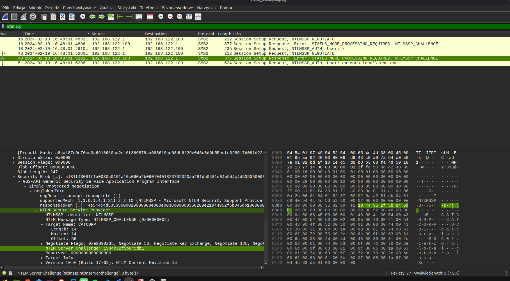
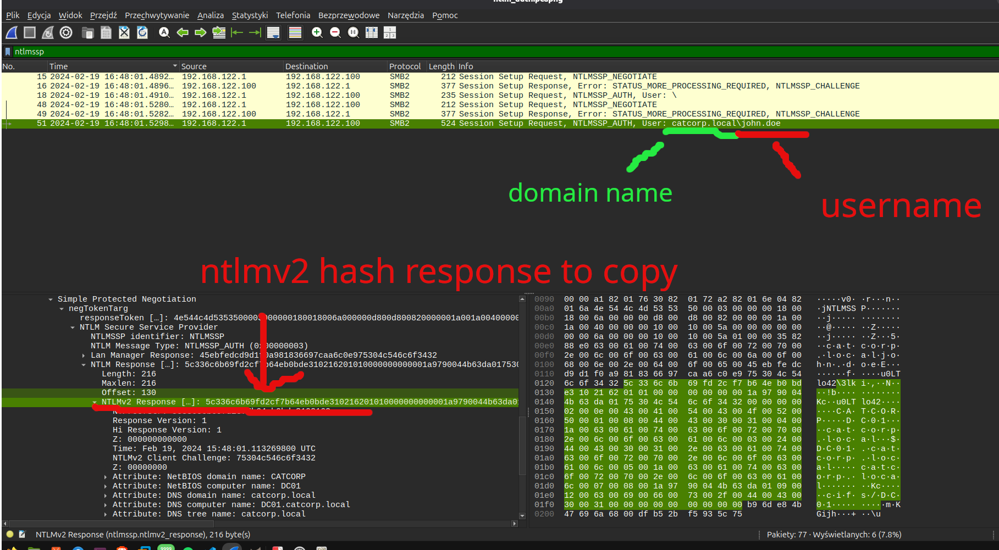
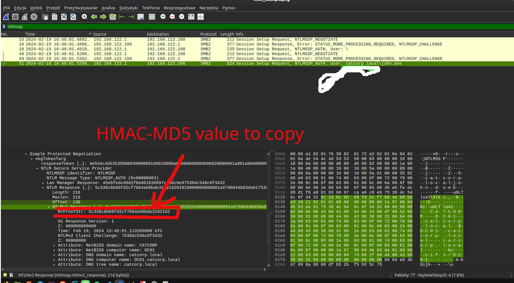
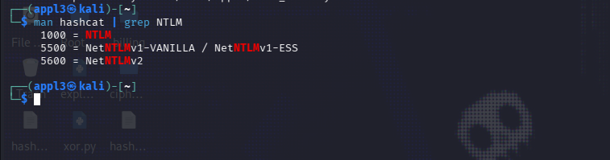
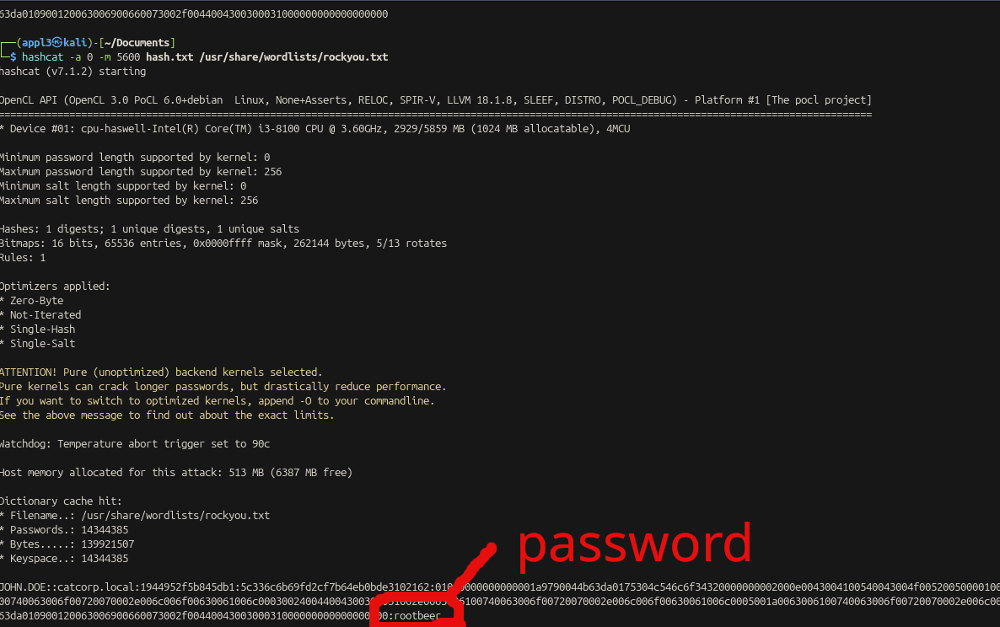

**Challenge:** You have been commissioned by the Cat Corporation SOC team to recover the password of a user linked to a suspicious NTLM over SMB connection.

**Flag format:** `RM{userPrincipalName:password}`

Since the flag format already tells us the shape of the answer, the plan is clear from the start: pull a username, a domain name and a password out of the capture.

## Background: how NTLM authentication works

NTLM is Microsoft's legacy challenge-response authentication protocol. It runs in three steps:

1. **Negotiate** – the client tells the server it wants to authenticate and lists the NTLM features it supports.
2. **Challenge** – the server replies with a random value, the *NTLM Server Challenge*.
3. **Authenticate** – the client hashes the user's password together with that challenge and sends the result back to the server.

Because the password itself is never sent, cracking the exchange means reconstructing the hash from the traffic and brute-forcing it offline.

## Filtering the capture

Opening the pcap in Wireshark, I filtered on:

```
ntlmssp
```

`NTLMSSP` (NT LAN Manager Security Support Provider) is the package that carries the NTLM challenge-response exchange inside SMB2, so this filter isolates exactly the three packets described above. For this task only two of them matter: the **challenge** packet and the **authentication** packet.



## Extracting the identity fields

The authentication packet (`NTLMSSP_AUTH`) exposes the account identity directly in the `User` field, and again inside the NTLM Secure Service Provider block:

- **Username:** `john.doe`
- **Domain name:** `catcorp.local`



Alongside these, the same packet carries the two values needed to rebuild the hash:

- **NTLM Server Challenge** (from the challenge packet): `1944952f5b845db1`
- **NTLMv2 Response**: `01010000000000001a9790044b63da0175304c546c6f34320000000002000e00430041005006f00630061006c00070008001a9790044b63da010900120063006900660073002f0044004300300031000000000000000000....`

## Extracting the HMAC-MD5 (NT Proof String)

The first 16 bytes of the NTLMv2 Response are the **NTProofStr**, an HMAC-MD5 value that hashcat needs as a separate field from the rest of the response:

- **HMAC-MD5 (NTProofStr):** `5c336c6b69fd2cf7b64eb0bde3102162`



## Choosing the right hashcat mode

With all four fields in hand, the next question is which hashcat mode understands them. Grepping hashcat's manual for NTLM confirms it:

```
man hashcat | grep NTLM
```



Mode **5600 (NetNTLMv2)** matches this protocol, and it expects the hash in the format:

```
user::domain:ServerChallenge:HMAC-MD5(NTProofStr):NTLMv2Response(without HMAC)
```

Assembling `hash.txt` from the values extracted above and running:

```
hashcat -a 0 -m 5600 hash.txt /usr/share/wordlists/rockyou.txt
```

## Cracking the hash

A dictionary attack against `rockyou.txt` cracks the hash almost instantly:



**Password:** `rootbeer`

## Flag

```
RM{john.doe@catcorp.local:rootbeer}
```
