# SOC Home Lab – Purple Team Project

## 📌 Cel projektu

Celem projektu było zbudowanie od podstaw domowego środowiska laboratoryjnego typu **SOC (Security Operations Center)**, symulującego realną infrastrukturę do wykrywania i analizy ataków. Lab obejmuje pełny cykl: przygotowanie infrastruktury sieciowej, wdrożenie systemu SIEM, podłączenie agenta na maszynie ofiary oraz przeprowadzenie ataków z perspektywy atakującego (Kali Linux) i obserwację ich detekcji po stronie obrońcy (Wazuh).

Projekt buduję jako element portfolio na potrzeby rekrutacji na stanowiska **junior penetration tester** oraz **SOC specialist**, pozycjonując się jako kandydat typu **Purple Team** (łączący perspektywę ataku i obrony).

---

## 🖥️ Środowisko / Host

| Parametr | Wartość |
|---|---|
| System hosta | Ubuntu 26.04 LTS |
| CPU | Intel i3-8100 |
| RAM | 16 GB |
| Hypervisor | VMware Workstation |
| Dodatkowy dysk | HDD zamontowany w `/mnt/dane` (przechowywanie danych) |

---

## 🌐 Architektura sieci

Lab składa się z **trzech maszyn wirtualnych** połączonych w izolowanej sieci VMware typu *host-only* (`VMnet1`, 172.16.10.0/24), niewidocznej z zewnątrz, tak aby ataki i ruch sieciowy pozostawały w pełni kontrolowane. Zakres 172.16.10.0/24 dobrano celowo, by nie kolidował ani z siecią TryHackMe (10.x), ani z domowym NAT-em (192.168.x).

| Maszyna | Rola | IP (VMnet1) | Hostname |
|---|---|---|---|
| Kali Linux | Atakujący / Red Team | 172.16.10.5 | kali |
| Ubuntu Victim | Cel ataku | 172.16.10.10 | ubuntuvictim |
| Ubuntu + Wazuh | SIEM / Blue Team | 172.16.10.20 | ubuntuwazuh |

Każda maszyna posiada **dwie karty sieciowe**: jedną w trybie **NAT** (internet, aktualizacje) i jedną w trybie **host-only VMnet1** (izolowana sieć laboratoryjna).

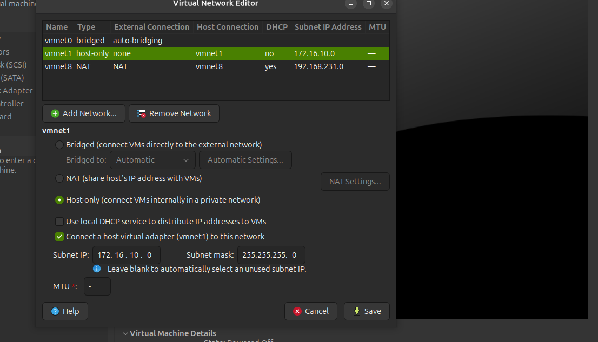
*Sieć host-only VMnet1 (172.16.10.0/24) skonfigurowana bez DHCP — adresacja statyczna na każdej maszynie.*

```
                    ┌────────────────────┐
        Internet ───┤   NAT (per VM)     │
                    └─────────┬──────────┘
                              │
   ┌───────────────┐   VMnet1 (host-only)   ┌────────────────────┐
   │  Kali Linux    │◄──────────────────────►│  Ubuntu Victim      │
   │ 172.16.10.5    │                        │ 172.16.10.10        │
   └───────────────┘                        └──────────┬─────────┘
                                                         │ agent
                                              ┌──────────▼─────────┐
                                              │  Wazuh SIEM         │
                                              │ 172.16.10.20        │
                                              └─────────────────────┘
```

---

## 🧩 Moduł 1 – Przygotowanie infrastruktury

Statyczne adresy IP na serwerach Ubuntu skonfigurowano przez netplan:

```yaml
network:
  version: 2
  ethernets:
    ens37:
      dhcp4: false
      addresses: [172.16.10.10/24]
```

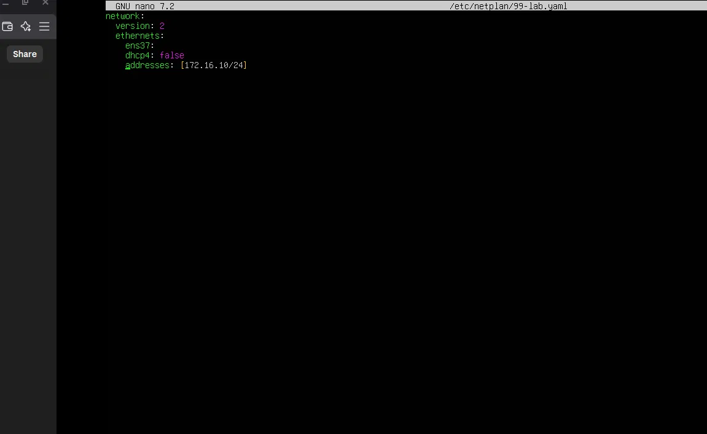

Po zastosowaniu (`netplan apply`) i weryfikacji `ip a` maszyna otrzymała poprawny adres na interfejsie host-only, obok drugiego interfejsu z NAT:

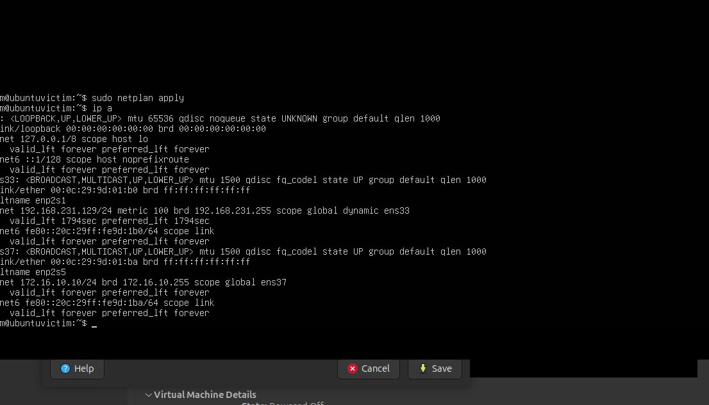
*Interfejs `ens33` = NAT (192.168.231.x), `ens37` = sieć laboratoryjna (172.16.10.10/24).*

Analogicznie skonfigurowano maszynę Wazuh (172.16.10.20):

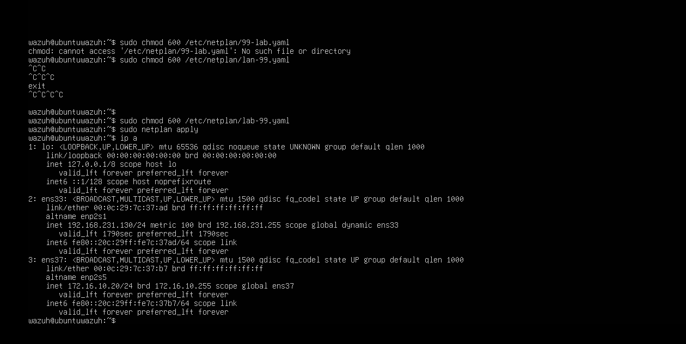

Na Kali karty sieciowe nie miały domyślnie aktywnych połączeń w NetworkManagerze, więc utworzono je ręcznie przez `nmcli`:

```bash
sudo nmcli con add type ethernet con-name nat-net ifname eth0
sudo nmcli con up nat-net
sudo nmcli con add type ethernet con-name lab-hostonly ifname eth1 ip4 172.16.10.5/24
sudo nmcli con up lab-hostonly
```

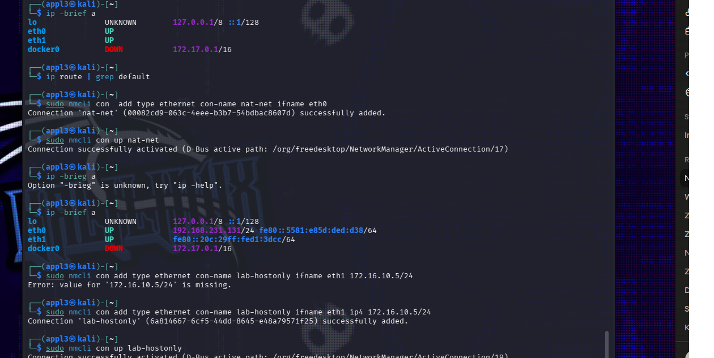

Na koniec zweryfikowano pełną łączność: Kali ↔ victim, Kali ↔ Wazuh oraz Kali ↔ internet:

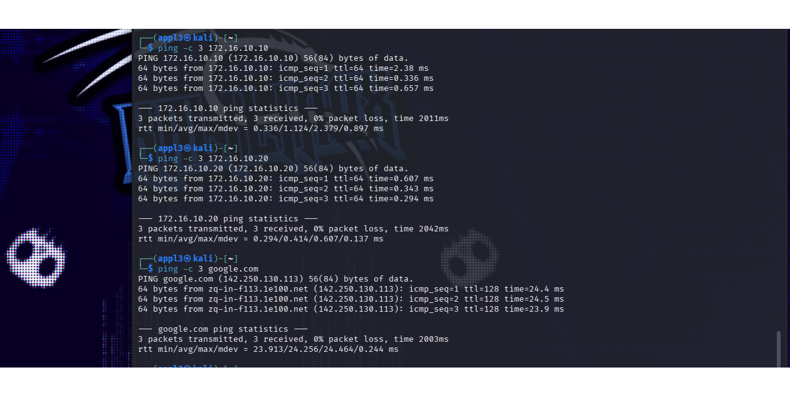
*0% packet loss do obu maszyn lab oraz do google.com — sieć w pełni funkcjonalna.*

---

## 🧩 Moduł 2 – Instalacja Wazuh SIEM

Wdrożono **Wazuh w wersji 4.14** na maszynie `ubuntuwazuh`. Pierwsze podejście — ręczna, krokowa generacja certyfikatów przez `wazuh-certs-tool.sh` z plikiem `config.yml` opisującym węzły indexera, servera i dashboardu — kończyło się powtarzającymi się błędami (narzędzie generowało tylko root-ca i admin, pomijając certyfikaty node'ów).

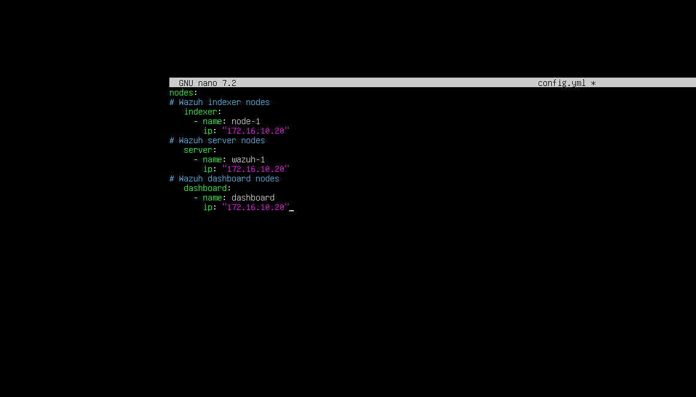
*Plik `config.yml` — wszystkie trzy role (indexer, server, dashboard) wskazane na ten sam host 172.16.10.20 (instalacja single-node).*

Ostatecznie zastosowano oficjalny **instalator all-in-one**, co zakończyło się sukcesem:

```bash
sudo bash wazuh-install.sh -a -o
```

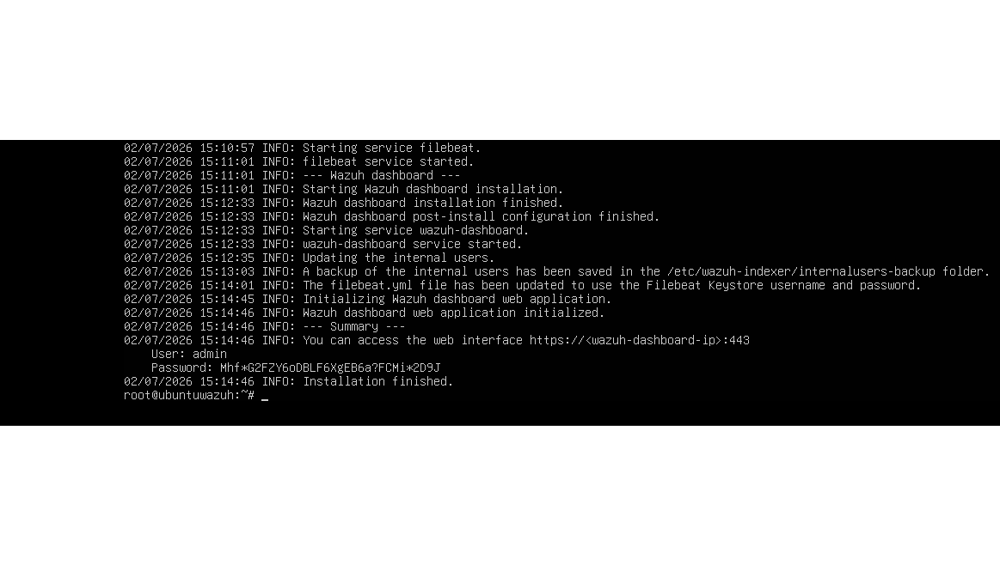
*Instalacja zakończona: dashboard, indexer i filebeat uruchomione, wygenerowane hasło admina.*

Dashboard stał się dostępny pod adresem `https://172.16.10.20`:


Panel Overview po pierwszym uruchomieniu, przed podłączeniem agenta:

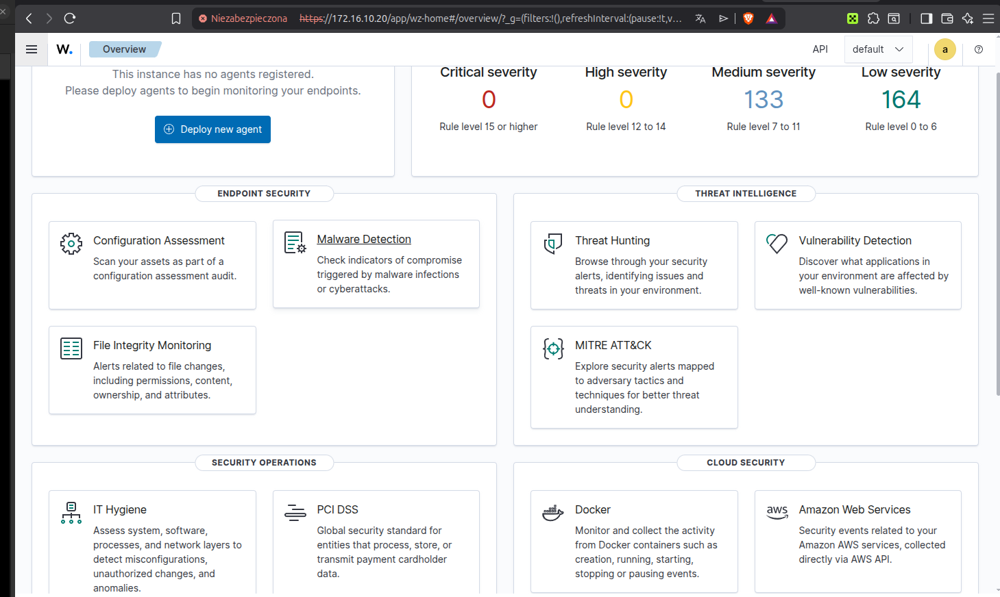

---

## 🧩 Moduł 3 – Wdrożenie agenta na maszynie ofiary

Na maszynie `ubuntuvictim` zainstalowano agenta Wazuh, wskazując managera SIEM przez zmienne środowiskowe:

```bash
wget https://packages.wazuh.com/4.x/apt/pool/main/w/wazuh-agent/wazuh-agent_4.14.6-1_amd64.deb \
&& sudo WAZUH_MANAGER='172.16.10.20' WAZUH_AGENT_NAME='victim' dpkg -i ./wazuh-agent_4.14.6-1_amd64.deb

sudo systemctl daemon-reload
sudo systemctl enable wazuh-agent
sudo systemctl start wazuh-agent
```

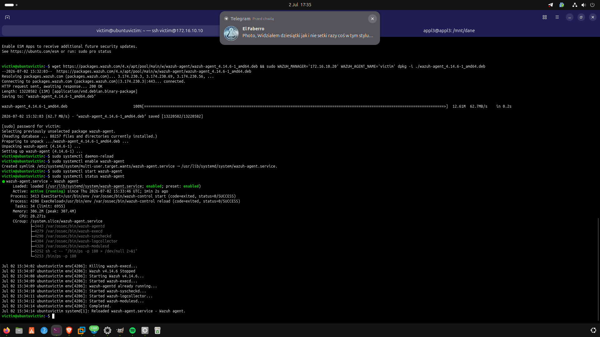
*Usługa `wazuh-agent.service` aktywna, wszystkie moduły (execd, syscheckd, logcollector, modulesd) wystartowane poprawnie.*

Agent widoczny i aktywny w panelu Wazuh:

| ID agenta | Nazwa | IP | System | Wersja | Status |
|---|---|---|---|---|---|
| 001 | victim | 172.16.10.10 | Ubuntu 24.04 LTS | 4.14.6 | 🟢 active |

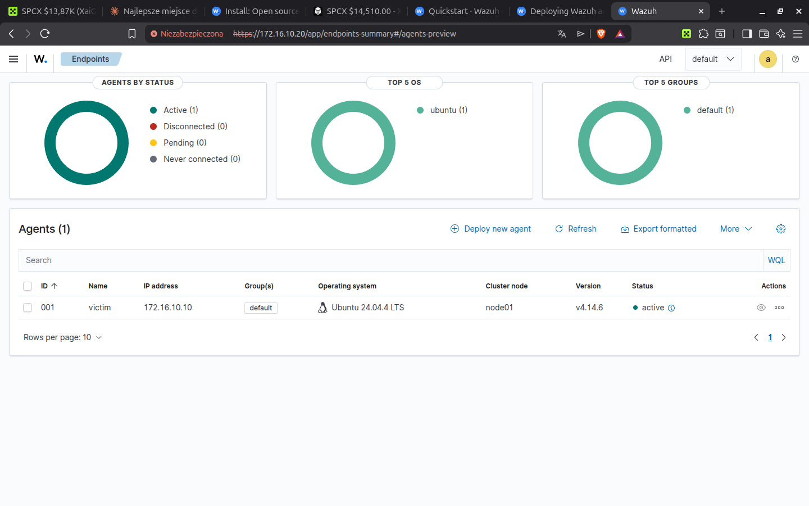

---

## 🧩 Moduł 4 – Atak → Detekcja

Ostatni etap laboratorium to przeprowadzenie ataków z maszyny Kali w kierunku `ubuntuvictim` i zweryfikowanie, jak zostają one wykryte przez Wazuh.

### Krok 1 — Rekonesans (nmap)

```bash
nmap -sV -p- 172.16.10.10
```

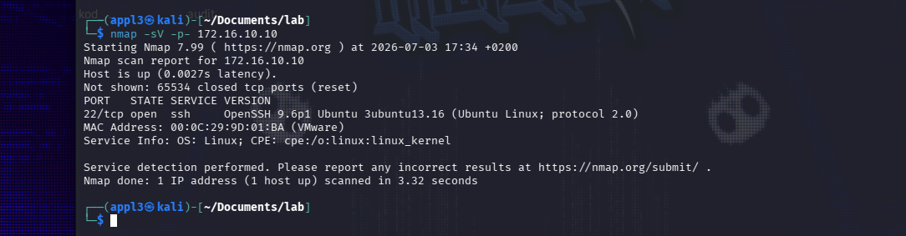
*Wynik: port 22/tcp otwarty, `OpenSSH 9.6p1 Ubuntu 3ubuntu13.16` — jedyna usługa nasłuchująca na hoście.*

### Krok 2 — Próba brute force SSH (hydra)

Pierwsza próba, z małą listą haseł testowych, nie powiodła się (0 poprawnych haseł — spodziewany wynik, posłużyła do weryfikacji, że atak faktycznie dociera do celu i generuje ruch):

```bash
hydra -l victim -P passowrds.txt ssh://172.16.10.10
```

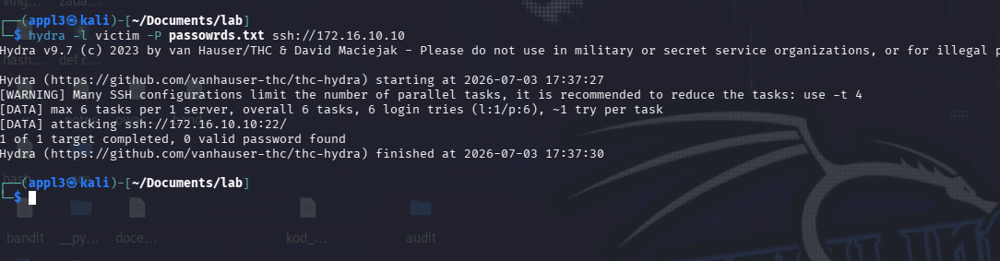

Nawet te nieudane próby logowania zostały od razu wychwycone przez Wazuh — w zakładce Threat Hunting widać 14 zdarzeń auth-failed z wyraźnym skokiem w czasie ataku:

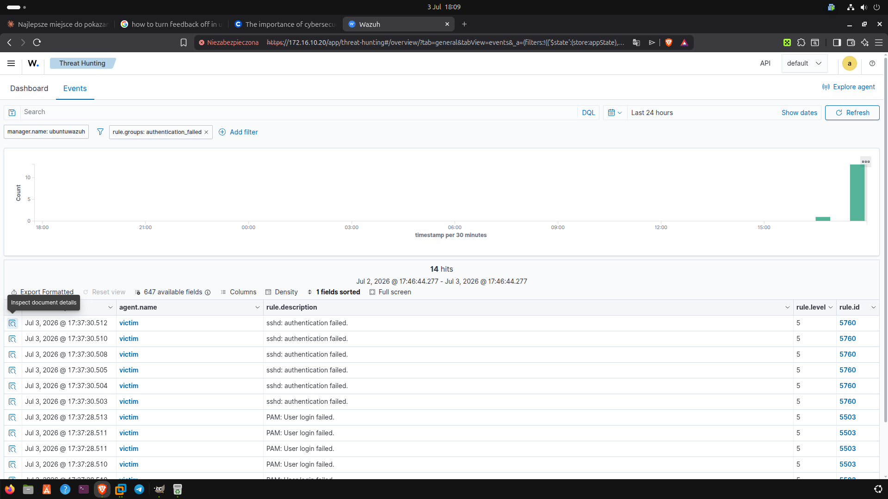
*Rule ID 5760 (`sshd: authentication failed`) i 5503 (`PAM: User login failed`), poziom 5 — pojedyncze nieudane logowania.*

### Krok 3 — Właściwy atak brute force (rockyou.txt) i korelacja

Po zwiększeniu liczby prób w krótkim czasie (atak z wykorzystaniem większej listy haseł), Wazuh skorelował pojedyncze niepowodzenia w **jeden alert wysokiego poziomu** — regułę wykrywającą wzorzec ataku, a nie tylko pojedyncze zdarzenie:

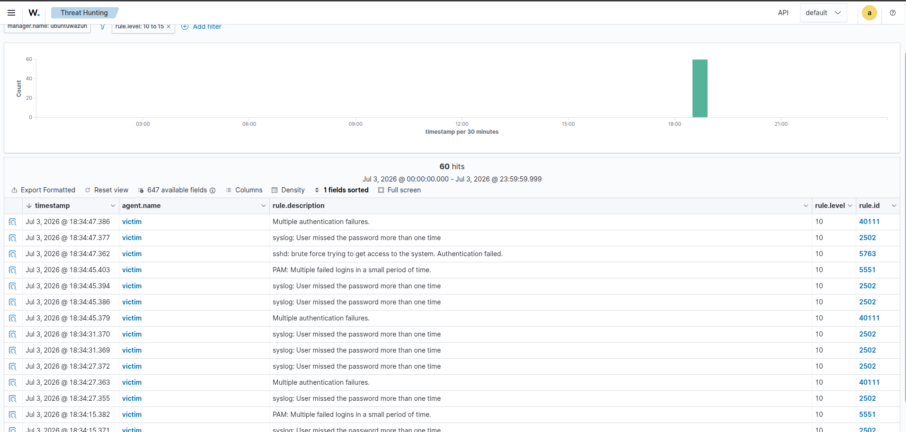

| Rule ID | Opis | Poziom |
|---|---|---|
| 5763 | `sshd: brute force trying to get access to the system. Authentication failed.` | **10** |
| 5551 | `PAM: Multiple failed logins in a small period of time.` | **10** |
| 40111 | `Multiple authentication failures.` | **10** |
| 2502 | `syslog: User missed the password more than one time` | **10** |

Łącznie 60 zdarzeń poziomu 10+ zarejestrowanych w oknie ataku — Wazuh poprawnie zidentyfikował próbę ataku brute force jako incydent wymagający uwagi, a nie tylko listę pojedynczych błędów logowania.

---

## ✅ Wnioski

Projekt pokazuje pełny cykl pracy Blue/Purple Team w środowisku laboratoryjnym:
1. zaprojektowanie i odizolowanie infrastruktury sieciowej (host-only VMnet1),
2. wdrożenie systemu SIEM klasy enterprise (Wazuh 4.14, instalacja all-in-one po nieudanej ręcznej generacji certyfikatów),
3. podłączenie i monitorowanie hosta końcowego (agent 001 – victim, aktywny),
4. przeprowadzenie kontrolowanego ataku (nmap recon + hydra brute force) i potwierdzenie jego wykrycia — od pojedynczych zdarzeń auth-failed (poziom 5) po skorelowany alert brute force (poziom 10, reguły 5763/5551/40111/2502).

Kluczowy wniosek defensywny: pojedyncza nieudana próba logowania to "szum" (poziom 5), ale Wazuh poprawnie eskaluje to do realnego alertu dopiero gdy wykryje **wzorzec** — kilka nieudanych prób w krótkim oknie czasowym. To dokładnie mechanizm, na którym opierają się reguły korelacyjne w prawdziwych SOC-ach.

Repozytorium: **`home-lab-purple-team`**
